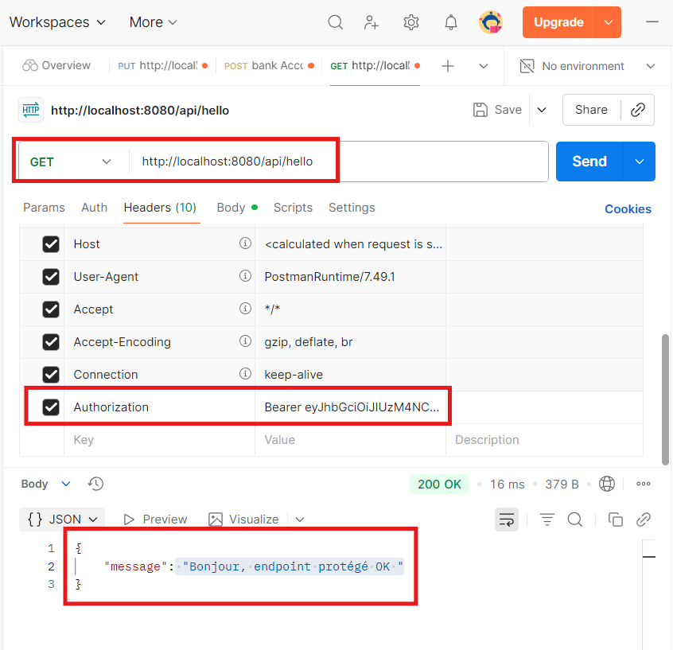
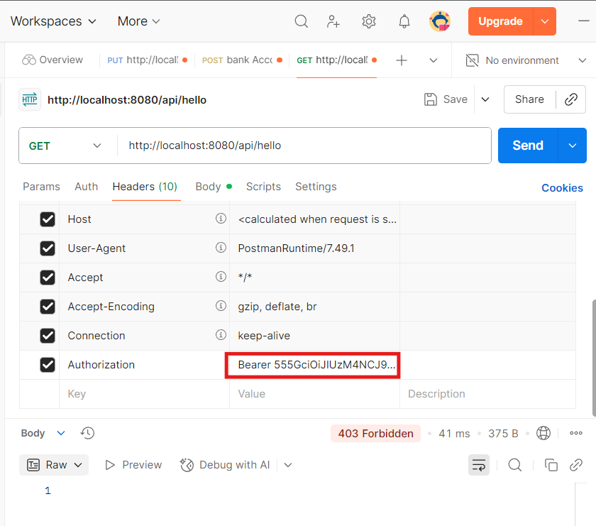
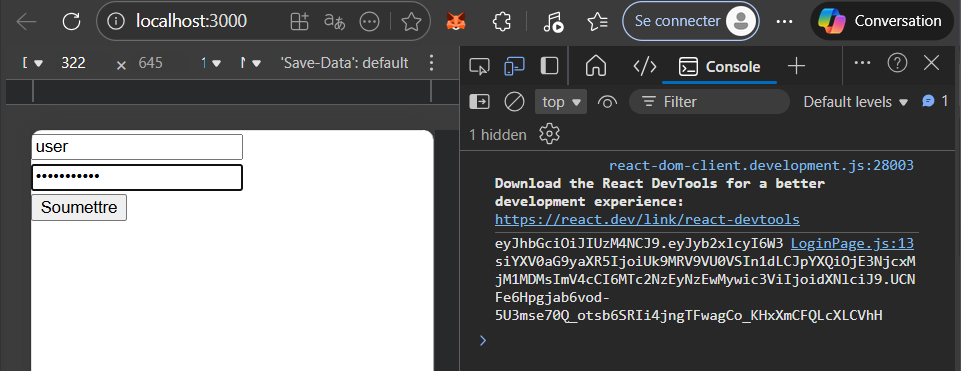
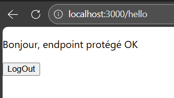
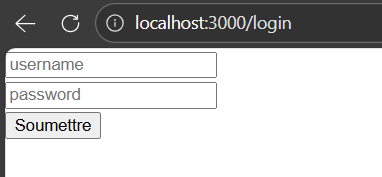

# Travail Pratique 2 : Authentification JWT

## Introduction

Ce projet a été réalisé dans le cadre d’un TP visant à comprendre et implémenter une authentification sécurisée basée sur **Spring Security** et **JSON Web Tokens (JWT)**.
L’objectif principal est de mettre en place :

* un **endpoint de connexion** (`/api/auth/login`) capable de générer un JWT valide,
* un **filtre d’autorisation** inspectant chaque requête entrante,
* une **protection des routes** nécessitant la présence d’un token valide,
* un système d’utilisateurs géré via **UserDetailsService**.

Ce projet constitue une base solide pour la construction d’API sécurisées dans un environnement Spring Boot moderne.

---

## I. **Structure du projet**

L’arborescence principale du projet est la suivante :

```
Authentication_Jwt
└── src
    ├── main
    │   ├── java
    │   │   └── org.example.authentication_jwt
    │   │       ├── config
    │   │       │   └── SecurityConfig.java
    │   │       ├── controller
    │   │       │   └── AuthController.java
    │   │       ├── filter
    │   │       │   └── JwtAuthFilter.java
    │   │       ├── model
    │   │       │   ├── AuthRequest.java
    │   │       │   └── AuthResponse.java
    │   │       └── service
    │   │           ├── JwtService.java
    │   │           ├── MyUserDetailsService.java
    │   │           └── AuthenticationJwtApplication.java
    │   └── resources
    │       └── application.properties
```

Chaque package est organisé pour respecter une architecture propre, claire et modulable :
`controller` pour les endpoints, `service` pour la logique métier, `filter` pour les inspections de requêtes, `config` pour la sécurité, etc.

---

## II. **Implémentation**

### **1. Configuration – `config/`**

### **SecurityConfig**

Cette classe configure Spring Security :

* **désactivation du CSRF** (utile pour une API REST),
* définition des routes publiques (`/api/auth/**`),
* obligation d’être authentifié pour toutes les autres routes,
* intégration du filtre personnalisé `JwtAuthFilter`,
* déclaration du `AuthenticationManager`.

Elle constitue le cœur du système de protection de l’API.

### **2. Contrôleur – `controller/`**

### **AuthController**

Expose deux endpoints :

✔ **POST /api/auth/login**

* prend un `username` et un `password`,
* vérifie les identifiants via `AuthenticationManager`,
* génère un JWT via `JwtService`,
* retourne un objet `AuthResponse` contenant le token.

✔ **GET /api/hello**

* endpoint protégé,
* nécessite un JWT valide dans l’en-tête `Authorization: Bearer <token>`.

### **3. Filtres – `filter/`**

### **JwtAuthFilter**

Ce filtre s’exécute **à chaque requête** (OncePerRequestFilter) :

1. vérifie si l’en-tête `Authorization` contient un `Bearer <token>`,
2. extrait et valide le JWT,
3. récupère l’utilisateur associé,
4. charge ses rôles depuis `UserDetailsService`,
5. place l’utilisateur dans le `SecurityContext`,
6. laisse la requête continuer si le token est valide.

Il assure ainsi l’autorisation des requêtes après la connexion.

### **4. Modèles – `model/`**

### **AuthRequest**

Représente la structure JSON envoyée lors du login :

```json
{
  "username": "...",
  "password": "..."
}
```

### **AuthResponse**

Réponse renvoyée après un login réussi :

```json
{
  "token": "..."
}
```

Des modèles simples mais essentiels pour communiquer avec Postman ou un frontend.

### **5. Services – `service/`**

### **JwtService**

Gère toute la logique liée au JWT :

* signature via une clé secrète,
* génération du token avec expiration,
* extraction du username,
* validation (signature + expiration).

Cette classe centralise la sécurité autour du token.

### **MyUserDetailsService**

Implémente `UserDetailsService` pour fournir des utilisateurs en mémoire :

* `user` avec rôle `USER`,
* `admin` avec rôle `ADMIN`.

C’est cette classe que Spring Security interroge pour authentifier un utilisateur lors du login.

---

## III. **Tests des Endpoints**

Les tests ont été effectués avec **Postman**.

### **1. Test du login**

**Endpoint :**

```
POST /api/auth/login
```

**Body (JSON) :**

```json
{
  "username": "user",
  "password": "password123"
}
```

**Résultat attendu :**

```json
{
  "token": "eyJhbGciOiJIUzI1NiJ9..."
}
```


### **2. Test d’un endpoint protégé**

**Endpoint :**

```
GET /api/hello
```

**Header à ajouter :**

```
Authorization: Bearer <TOKEN_RECU>
```

**Réponse attendue :**

```json
{
  "message": "Bonjour, endpoint protégé OK "
}
```


Si le token est absent ou invalide → **403 Forbidden**


Si expiré → **403 Forbidden** avec message de refus du filtre.

---

## IV. Partie Frontend

Afin de valider concrètement le fonctionnement de l’authentification JWT côté client, un **frontend léger en React** a été ajouté au projet.
Ce frontend permet de :

* tester l’authentification via un formulaire de login,
* récupérer et stocker le token JWT,
* accéder à un endpoint protégé,
* gérer la déconnexion (logout).

Cette approche permet de simuler un **flux réel frontend ↔ backend**, similaire à une application web moderne.

### 1. **Structure du projet (mise à jour)**

Le projet est désormais composé de **deux parties distinctes** :

```
Authentication_jwt/
├── backend-spring (Spring Boot – API sécurisée JWT)
└── jwt-front (React – Frontend de test)
```

* Le backend Spring Boot expose des endpoints REST sécurisés par JWT.
* Le frontend React consomme ces endpoints via HTTP (Axios).

Les deux projets sont **séparés logiquement**, mais exécutés localement et communiquent via HTTP.

### **2. Configuration générale**

* Utilisation de **React Router DOM** pour la navigation.
* Utilisation de **Axios** pour les appels HTTP.
* Mise en place d’un **proxy** vers le backend Spring Boot :

```json
"proxy": "http://localhost:8080"
```

Cela permet d’appeler directement les endpoints backend sans gérer les problèmes de CORS.

### **3. Page de connexion – `LoginPage`**

La page de login permet à l’utilisateur de :

1. saisir son `username` et son `password`,
2. envoyer les informations au backend (`/api/auth/login`),
3. récupérer le token JWT retourné,
4. stocker le token dans le `localStorage`,
5. rediriger l’utilisateur vers la page protégée.

**Fonctionnement logique :**

* Le formulaire déclenche un appel POST vers le backend.
* En cas de succès, le token JWT est stocké localement.
* L’utilisateur est automatiquement redirigé vers `/hello`.

Cette page constitue le **point d’entrée de l’application**.

### **4. Page protégée – `HelloPage`**

La page `HelloPage` représente une **zone protégée**, accessible uniquement avec un token valide.

**Fonctionnement :**

1. récupération du token depuis le `localStorage`,
2. si aucun token n’est présent → redirection vers `/login`,
3. appel du endpoint protégé `/api/hello` avec l’en-tête :

   ```
   Authorization: Bearer <token>
   ```
4. affichage du message retourné par le backend,
5. gestion des erreurs (token expiré ou invalide).

### **5. Gestion du logout**

Un bouton **Logout** permet de :

* supprimer le token JWT du `localStorage`,
* rediriger l’utilisateur vers la page de login.

Cette étape simule une **déconnexion complète côté client**.

### **6. Routage de l’application**

Le routage React est défini de la manière suivante :

* `/login` → page de connexion
* `/hello` → page protégée
* toute autre route → redirection vers la page de login

Cela garantit que l’utilisateur ne peut pas accéder directement à une page protégée sans authentification.


### **7. Test via le frontend React**

Les tests ne sont plus limités à Postman et ont été réalisés via l’interface React :

### **Étapes du test :**

1. accès à la page `/login`,
2. authentification avec un utilisateur valide,
3. réception et stockage du token JWT,
4. redirection automatique vers `/hello`,
5. affichage du message sécurisé provenant du backend,
6. déconnexion via le bouton Logout.








### **Gestion des erreurs**

* Si le token est absent → redirection vers `/login`
* Si le token est expiré ou invalide → suppression du token + redirection
* Si l’utilisateur tente d’accéder directement à `/hello` sans token → accès refusé

Ces comportements confirment la **bonne implémentation de la sécurité côté client et serveur**.

---

## Conclusion

Ce TP a permis de mettre en place et de valider un système complet d’authentification basé sur **Spring Security** et **JWT**, incluant à la fois le backend et un frontend léger en React pour les tests.

Le projet illustre plusieurs concepts clés :

* construction d’une **API REST sécurisée** avec Spring Boot,
* gestion des utilisateurs via **UserDetailsService**,
* génération, validation et expiration des **tokens JWT**,
* filtrage des requêtes via un **filtre personnalisé**,
* sécurisation de routes et protection d’accès,
* consommation sécurisée des endpoints depuis un **frontend React**,
* gestion correcte des sessions et de la déconnexion côté client.

Cette architecture démontre une **séparation claire entre backend et frontend**, une **gestion stateless de l’authentification** et constitue une base solide pour des applications modernes nécessitant des **API sécurisées**, comme les microservices ou les architectures orientées API.

---
**PS** : le dossier frontend est dans le projet spring juste pour le commit. une fois cloné mettre séparément les deux projets dans le meme répertoire pour tester

---

## Réalisé par :

 - **Nom :** Wendbénédo Albéric Darius Konsebo
 - **Module :** Sécurité des Systèmes Distribués
 - **Encadré par :** M. Abdelmajid BOUSSELHAM
 - **Année académique :** 2025 - 2026